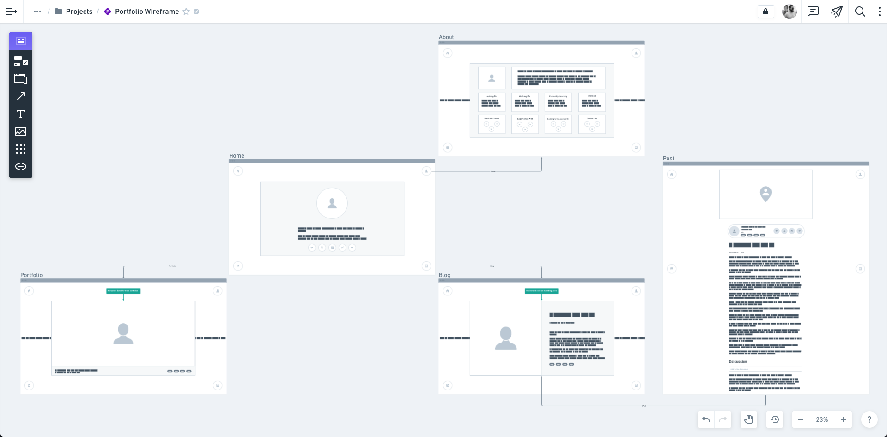
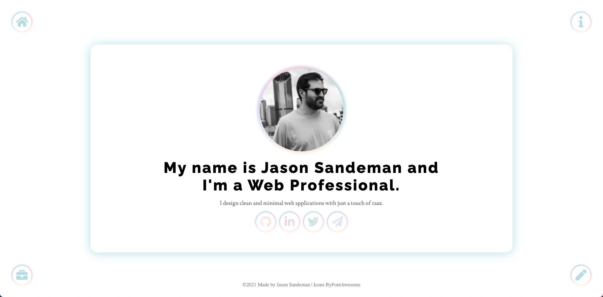
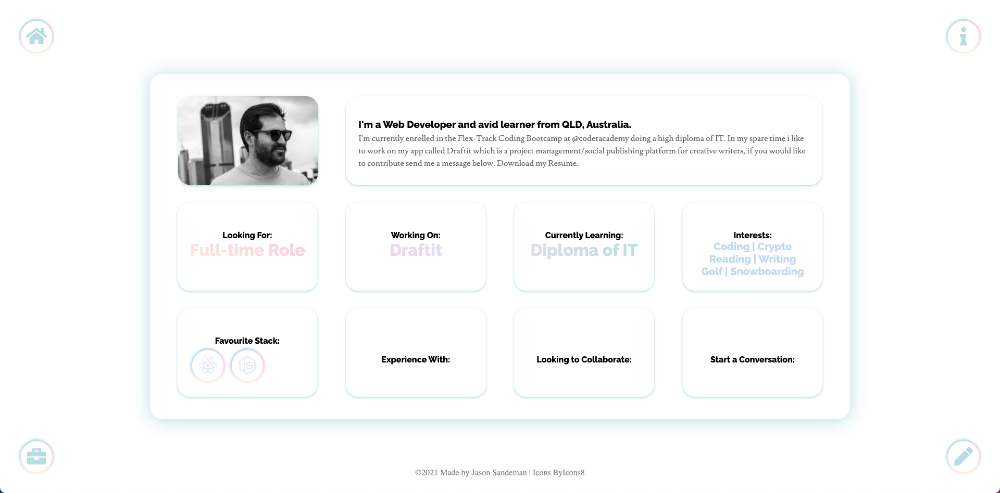
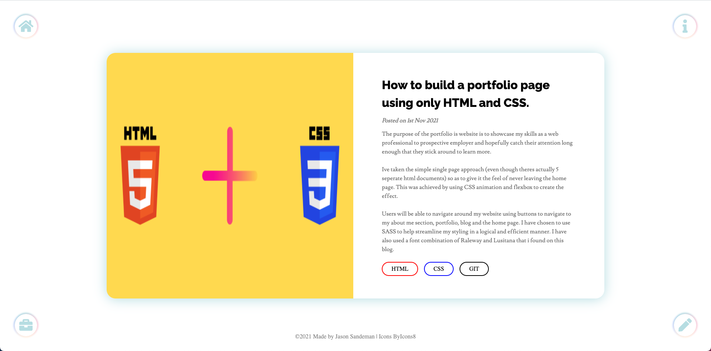
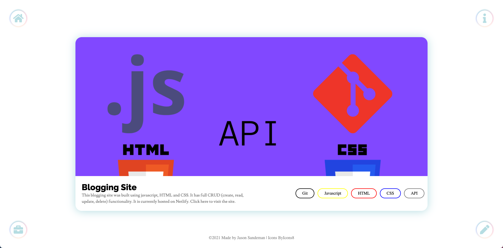
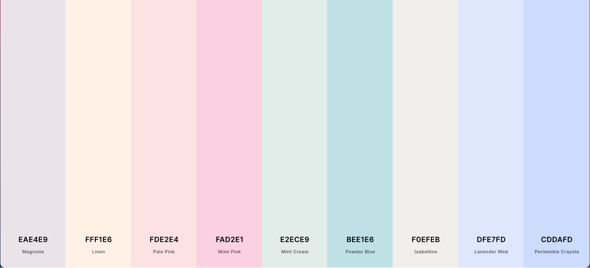

# Portfolio Website - Jason Sandeman

## Links

View the Website [here]().

View the source code on GitHub [here]().

---

## Project Description

The purpose of the portfolio is website is to showcase my skills as a web professional to prospective employers and hopefully catch their attention long enough that they stick around to learn more.

### Target Audience

- It's important when your building a site to keep in mind who the target audience will be. This is not only important for design decisions but it will also help you craft the overal tone and message that will be delivered when someone visits your site.

- My target audience will be a prospective employer with a strong background in software development, programming languages, industry standard tech stacks and design principles. They will have high expectations for a candidate to standout from the crowd with a professional and functional design that proves a hard work ethic and a genune passion for keeping up to date with the latest trends and technologies.

### Design Mentality

- Ive taken the simple single page approach (even though theres actually 5 seperate html documents) so as to give it the feel of never leaving the home page. This was achieved by using flexbox and CSS animation to create the effect.

- Users will be able to navigate around my website using 4 buttons which will navigate to my 'about me', 'portfolio, blog and the home page.

- I have chosen to use SCSS to help with streamlining the styling in a logical and efficient manner.

---

## Project Planning

### Project Management Dashboard

- First thing i did and i reccommend this to anyone starting a new project it to create a project dashboard where you can manage the project from start to finish. I used Notion to create mine however this can be done on your prefferred project management platform of choice. Some of the more popular ones are Trello, Notion and Asana just to mention a few. Here is a link to my project on [Notion](https://jwsandeman.notion.site/T1A2-Portfolio-Website-82cb51ae84d149038dfa7b5ee00ab4c0)

### Software Requirements

- Next you need to look at your design brief and client/software requirements. This should be obvious but you need to write these down, preferably in your project dashboard. You'll be surprised how many times you reference these whilst building your project. My design brief is an assignment so ive got plenty of information to reference.

### Sitemap

- Now that you know your software requirements, its time for a sitemap.

  

### Planning

- Once you've set up your dashboard now its time to break the project down into manageable chunks. Start at the high level deliverables and work your way down to the smallest tasks. This can be time consuming but as Benjamin Franklin says "If you fail to plan, you are planning to fail."

### Inspiration/Mood Board

- Now that you have a plan its time to find some inspiration. This is one of the more enjoyable parts of starting a new project, where you get to dive head first into the depths of the bottomless internet and find sites that inspire you and that would fit the client design spec well. A word of warning - don't spend too much time on this. Set a time limit and stick to it, otherwise inspiration turns into procrastination (speaking from personal experience).

### Wireframe

- Once you crawl out of the catacombs of the internet and have closed all of your tabs on all of your screens its time to start on the wireframe. This can be a simple(low-fidelity) or complicated(high-fidelity) approach, its up to you. I prefer to keep it simple at first by sketching it out roughly on the ipad and then ill move to a more concrete wirframe when im happy with the overall design.  

---

## Tech Stack

Before we start building the project id like to go over the tech stack that i plan on using and the reasons why i chose each technology.

### Project Management

- To keep myself organised and accountable i used **_Notion_**. Its a hybrid between trello, google docs, quip and has handy tools like kanban boards, lists, calendars, gant charts, tables/databases and is basically my one stop shop for organising my entire life.

### Time Management

- I use 2 techniques to help stay on track. The 1st tool is the **_pomodoro technique_** which i think most people have heard of, if not google it.

- The second tool i use is a free phone app called **_Structured_** which lets you break up your day into single manageble task that you can set a time limit on. As the day progresses structured counts down each task and gives you a great visual on how much time you have left on your current task until the next task begins. Simple but very very effective.

### Code Editor

- **_Visual Studio Code_** is my favourite code editor. The amount of helpful extensions alone are enough to justify this over other IDE's for me. Live server, Prettier and Bracket Pair Colouriser being some of my favourites. I also like the layout and the collaboration tools, and I don't think i could go back to an IDE that doesnt have an in-built terminal.

### HTML

- Ive chosen **_HTML_** not only because it is a reuqirement of my assignment but because it is stil a fast and effective way to design static websites that look amazing.

### CSS/SCSS

- **_CSS_** is essential for any website to overlay desired styling, fonts, animations and colours. Ive also decided to use **_SCSS_** to help simplify the design process with variables, @mixins and nesting.

### Version Control

- For version control i am using **_Git_** and my source code is available on **_GitHub_**.

### Hosting

- I have chosen to host my portfolio site on **_Netlfiy_** because of how easy they have made the process. Also, its free.

### Security

- I used **_Subresource Integrity_** as reccommended by Coder Academy

---

## Initialise The Project

Now that we are clear on our project requirements and intended tech stack it is time to intitialise the project! Lets open the terminal (we will move to VS code later) and perform the following steps:

1. Make a new directory for the project and move into that directory

   `mkdir JasonSandeman_T1A2`

   `cd JasonSandeman_T1A2`

2. now let's initialise git in the project. Document control is essential - even when working on your own.
   `git init`

3. Now lets set up the directory with the intial folders and files

   `mkdir docs`

   `mkdir ppt`

   `mkdir src`

   `echo "# Portfolio Website - Jason Sandeman" >> README.md`

   `git log > gitlog.txt`

4. Now its time for our intial commit

   `git add .`

   `git commit -m "initial commit, added README/gitlog/sitemap, added project description and sitemap to README"`

5. Create a new repository in GitHub

6. Follow GitHubs commands to link your local directory with your remote GitHub repository

   `git remote add origin git@github.com:jwsandeman/JasonSandeman_T1A2.git`

   `git branch -M main`

   `git push -u origin main`

7. Once thats done we can open the folder in VS code using the following command

   `code .`

8. Lets code! I'll start with the HTML pages first and then move onto the CSS. For the sake of time ill use some progress screenshots rather than explaining every step of the process. Also be sure to make regular commits and save your work!

- Desktop halfway progress shots: 

- Mobile halfway progress shots:

- Tablet halfway progress shots:

- Desktop completed:

- Mobile completed:

- Tablet completed:

---

## Components and Features

Now lets talk about what components and features i used in my design.

### Responsive Design

- I designed this website with responsive layouts in mind. When the screen size changes, the layout and typography is optimised for the current screen size. I have used 3 main media breakpoints - Desktop, Tablet and Mobile.

### Site Navigation

- Desktop - I have used 4 buttons placed in eah corner of the web page to allow users to navigate around my portfolio. When a user hovers over one of the buttons the icon will rotate and dislay the link description

- Mobile - I have opted for the tradtional burger menu at the top of the screen to diplay the navigation menu.

### Main Body Theme

- Desktop - I am using a business card style to display all of my information on. This shows that i understand flexbox and helps keep the attention on the center of the screen rather than having to scroll or navigate menus.

- Mobile - I used a single vertical column scrolling layout for the mobile as the card theme would not work well on smaller screens.

### Footer

- Desktop/Mobile - The Footer is a simple copyright with my name.

### About Me Card

- Desktop - I used a grid styled approach for the 'about me' section. This shows off important information and stats that i want to user to be able to ascertain at a glance.

- Mobile - I used the single vertical scrolling column layout here.

### Blog Card

- Desktop - Here i used a split row layout on the card so as to give a preview of the blog image and the content contained in the blog. The whole card is a link to the associated blog post.

- Mobile - I used a smaller version of the card to give a preview of the image and the article. These previews are in a single vertical scrolling column layout.

### Portfolio Card

- Desktop - I used vertical column layout so that you can see the screenshots preview of each website i have worked on. I also included a small horizontal information bar at the bottom. This bottom bar has a link to the associated website.

- Mobile - I used a smaller version of the card to give a preview of the website and the information bar. These previews are in a single vertical scrolling column layout.

### Blog Post

- Desktop/Mobile - I used a vertical scrolling column with an image as the post header. Then you have the post meta data and tags followed by the heading and publish date. After that the user can read the blog post by scrolling down the page.

---

## Attribution

### Font/Typography

- I have used a font combination of Raleway and Lusitana that i found on this [blog](https://inkbotdesign.com/font-combinations/).

### Color Palette

- The Colour pallet i have chosen came from [Coolors](https://coolors.co/eae4e9-fff1e6-fde2e4-fad2e1-e2ece9-bee1e6-f0efeb-dfe7fd-cddafd) and is as follows: 

### Icons

- For my icons i used [Font Awesome](https://fontawesome.com/).

### Images

- I created most of my images in Canva and my profile pic was taken by a friend of mine named James Stocks who gave me the image to use freely. His portflio can be found [here](https://jamesstocks.myportfolio.com/).

### Markdown -> HTML converter

- I used a markdown converter script in the header to insert my markdown file directly into this blog post. This saved me a ton of time as i already had a correctly formatted markdown file with my blog post written on it. If your reading the markdown file instead of the website, you can see the end result [here](https://festive-aryabhata-690f3c.netlify.app/post1.html).

  Here is the ISC License attribution:

  ISC License

  Copyright (c) 2021, Jason Lee <jason@zerodevx.com> (jason@zerodevx.com)

  Permission to use, copy, modify, and/or distribute this software for any
  purpose with or without fee is hereby granted, provided that the above
  copyright notice and this permission notice appear in all copies.

  THE SOFTWARE IS PROVIDED "AS IS" AND THE AUTHOR DISCLAIMS ALL WARRANTIES
  WITH REGARD TO THIS SOFTWARE INCLUDING ALL IMPLIED WARRANTIES OF
  MERCHANTABILITY AND FITNESS. IN NO EVENT SHALL THE AUTHOR BE LIABLE FOR
  ANY SPECIAL, DIRECT, INDIRECT, OR CONSEQUENTIAL DAMAGES OR ANY DAMAGES
  WHATSOEVER RESULTING FROM LOSS OF USE, DATA OR PROFITS, WHETHER IN AN
  ACTION OF CONTRACT, NEGLIGENCE OR OTHER TORTIOUS ACTION, ARISING OUT OF
  OR IN CONNECTION WITH THE USE OR PERFORMANCE OF THIS SOFTWARE.

---

Thankyou for taking the time to read this. I put a lot of effort into it an i hope it has helped you in some way.
